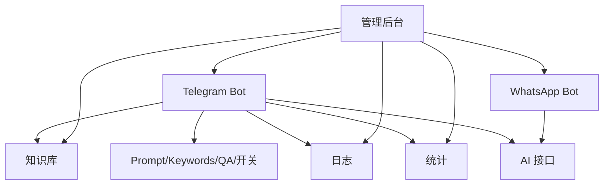

# 🤖 Telegram AI Bot - 智能自动回复系统

<div align="center">

[](https://www.python.org/)
[](https://github.com/LonamiWebs/Telethon)
[](https://streamlit.io/)
[](LICENSE)

基于 AI 的 Telegram 自动回复机器人，支持私聊/群聊、上下文记忆、热更新配置、消息群发和 Web 管理后台。

[快速开始](#-快速开始) | [功能特性](#-功能特性) | [安装指南](#-安装指南) | [使用文档](#-使用文档)

</div>

---

## 📋 目录

- [功能特性](#-功能特性)
- [系统要求](#-系统要求)
- [快速开始](#-快速开始)
- [详细安装](#-详细安装)
- [使用指南](#-使用指南)
- [项目结构](#-项目结构)
- [系统架构](#-系统架构)
- [常见问题](#-常见问题)
- [更新日志](#-更新日志)

---

## ✨ 功能特性

### 🤖 核心功能

- ✅ **智能自动回复**
  - 基于 DeepSeek/GPT 的 AI 回复
  - 支持私聊和群聊（关键词触发）
  - 上下文记忆（最近 8 条消息）
  - 模拟真人打字延迟

- ✅ **热更新配置**
  - 实时修改 AI 人设（`prompt.txt`）
  - 动态调整触发关键词（`keywords.txt`）
  - 无需重启机器人

- ✅ **消息群发**
  - 基于 Telegram 聊天分组
  - 防封禁机制（随机延迟 5-15 秒）
  - 实时进度显示
  - 异常处理（FloodWait/PeerFlood）

- ✅ **Web 管理后台**
  - 基于 Streamlit 的现代化界面
  - 机器人启动/停止控制
  - 在线编辑配置文件
  - 实时日志监控
  - 图形化群发工具

### 🎯 技术亮点

- 🔄 异步事件循环处理
- 🗄️ 独立 Session 避免数据库冲突
- 📝 实时日志输出（unbuffered）
- 🛡️ 完善的异常处理
- 🎨 美观的用户界面

---

## 💻 系统要求

### 基础要求

- **操作系统**：Windows 10+, macOS 10.14+, Linux (Ubuntu 18.04+)
- **Python**：3.8 或更高版本
- **网络**：稳定的互联网连接
- **存储**：至少 500 MB 可用空间

### 必需的 API 密钥

1. **Telegram API**（免费）
   - 访问 https://my.telegram.org
   - 创建应用获取 `api_id` 和 `api_hash`

2. **AI API**（根据你的选择）
   - DeepSeek API
   - OpenAI API
   - 其他兼容 OpenAI 格式的 API

---

## 🚀 快速开始

### 方式 1：一键安装（推荐）

#### Windows
```cmd
# 1. 下载项目
git clone <项目地址>
cd AI-Talk

# 2. 运行安装脚本
install.bat

# 3. 配置环境变量
# 编辑 .env 文件，填入你的 API 密钥

# 4. 启动管理后台
start_admin.bat
```

#### Linux/Mac
```bash
# 1. 下载项目
git clone <项目地址>
cd AI-Talk

# 2. 运行安装脚本
chmod +x install.sh
./install.sh

# 3. 配置环境变量
# 编辑 .env 文件，填入你的 API 密钥

# 4. 启动管理后台
./start_admin.sh
```

### 方式 2：手动安装

详见 [INSTALLATION.md](INSTALLATION.md)

---

## 📦 详细安装

### 步骤 1：环境准备

#### 1.1 安装 Python

**Windows:**
1. 访问 https://www.python.org/downloads/
2. 下载 Python 3.8+ 安装包
3. 安装时勾选 "Add Python to PATH"

**Linux:**
```bash
sudo apt update
sudo apt install python3.8 python3-pip
```

**Mac:**
```bash
brew install python@3.8
```

#### 1.2 验证安装

```bash
python --version  # 应显示 Python 3.8.x 或更高
pip --version     # 应显示 pip 版本
```

### 步骤 2：下载项目

```bash
# 如果有 Git
git clone <项目地址>
cd AI-Talk

# 或者手动下载 ZIP 并解压
```

### 步骤 3：安装依赖

```bash
# 使用一键安装脚本
# Windows
install.bat

# Linux/Mac
chmod +x install.sh
./install.sh

# 或手动安装
pip install -r requirements.txt
```

### 步骤 4：配置环境变量

1. 复制 `.env.example` 为 `.env`：
```bash
# Windows
copy .env.example .env

# Linux/Mac
cp .env.example .env
```

2. 编辑 `.env` 文件，填入你的配置：
```env
TELEGRAM_API_ID=你的API_ID
TELEGRAM_API_HASH=你的API_HASH
AI_API_KEY=你的AI密钥
AI_BASE_URL=https://api.55.ai/v1
AI_MODEL_NAME=deepseek-v3.1
```

### 步骤 5：首次登录

```bash
# 运行 main.py 完成 Telegram 登录
python main.py

# 按提示输入：
# 1. 手机号（+86xxxxxxxxxx）
# 2. 验证码（Telegram 发送）
# 3. 云密码（如果启用了两步验证）
```

### 步骤 6：启动管理后台

```bash
# Windows
start_admin.bat

# Linux/Mac
./start_admin.sh

# 或直接运行
streamlit run admin_multi.py
```

浏览器会自动打开 `http://localhost:8501`

---

## 📖 使用指南

### 1. Web 管理后台

#### 启动机器人
1. 访问 `http://localhost:8501`
2. 在侧边栏选择 **Telegram** 平台
3. 点击 **"🚀 启动"** 按钮
4. 查看 "日志" Tab 确认启动成功

#### 配置 AI 话术
1. 切换到 **"🧠 话术配置"** Tab
2. 左侧编辑 AI 人设
3. 右侧编辑触发关键词
4. 点击 "保存" 按钮
5. ✨ 立即生效！

#### 消息群发
1. 切换到 **"📢 消息群发"** Tab
2. 点击 "加载分组"
3. 选择目标分组
4. 输入消息内容
5. 确认后开始群发

### 2. 命令行工具

#### 运行自动回复机器人
```bash
python main.py
```

#### 运行群发工具
```bash
python broadcast.py
```

#### 环境检查
```bash
python check_env.py
```

---

## 📁 项目结构

```
AI-Talk/
├── 核心程序
│   ├── main.py                    # 自动回复机器人
│   ├── admin.py                   # Web 管理后台
│   ├── broadcast.py               # 命令行群发工具
│   └── check_env.py               # 环境检查工具
│
├── 配置文件
│   ├── .env                       # 环境变量（需手动配置）
│   ├── .env.example               # 环境变量模板
│   ├── prompt.txt                 # AI 人设（热更新）
│   ├── keywords.txt               # 触发关键词（热更新）
│   └── requirements.txt           # Python 依赖包
│
├── 启动脚本
│   ├── install.bat                # Windows 一键安装
│   ├── install.sh                 # Linux/Mac 一键安装
│   ├── start_admin.bat            # Windows 启动管理后台
│   └── start_admin.sh             # Linux/Mac 启动管理后台
│
├── 文档
│   ├── README.md                  # 项目说明（本文件）
│   ├── INSTALLATION.md            # 详细安装指南
│   ├── ADMIN_README.md            # 管理后台使用说明
│   ├── BROADCAST_README.md        # 群发工具使用说明
│   ├── DATABASE_LOCK_FIX.md       # 数据库锁定问题解决
│   └── LOG_TROUBLESHOOTING.md     # 日志问题排查
│
└── 运行时文件（自动生成）

## 商用功能面板概览
- AI 配置中心：在后台 [admin_multi.py](file:///d:/AI%20Talk/admin_multi.py) 的“AGNT AI配置中心”面板管理服务商与模型；配置落盘至 [ai_providers.json](file:///d:/AI%20Talk/data/tenants/default/ai_providers.json)（按租户隔离）。
- API 接口管理中心：在后台“API接口管理中心”面板维护路由与限流；配置落盘至 [api_gateway.json](file:///d:/AI%20Talk/data/tenants/default/api_gateway.json)。
- 系统配置自动化：支持一键生成 .env、会话静默初始化与敏感信息加密，密钥路径 [vault.key](file:///d:/AI%20Talk/data/tenants/default/vault.key)。
    ├── userbot_session.session    # Telegram 登录凭证
    ├── admin_session.session      # 管理后台 Session
    ├── bot.pid                    # 机器人进程 PID
    └── bot.log                    # 运行日志
```

---

## 🎯 使用场景

### 场景 1：个人助理
```
自动回复朋友、家人的消息
保持在线状态
不错过重要信息
```

### 场景 2：客服机器人
```
自动回答常见问题
24/7 在线服务
减轻人工客服压力
```

### 场景 3：社群管理
```
群聊自动回复（关键词触发）
批量发送通知
活动邀请
```

### 场景 4：营销推广
```
定向群发消息
客户维护
产品推广
```

---

## ❓ 常见问题

### Q1: 如何获取 Telegram API 密钥？

**A:** 
1. 访问 https://my.telegram.org
2. 登录你的 Telegram 账号
3. 进入 "API development tools"
4. 创建应用，获取 `api_id` 和 `api_hash`

### Q2: 支持哪些 AI 模型？

**A:** 
支持所有兼容 OpenAI API 格式的模型：
- ✅ DeepSeek
- ✅ OpenAI GPT-3.5/4
- ✅ Azure OpenAI
- ✅ 本地部署的模型（如 LocalAI）

### Q3: 群发会被封号吗？

**A:** 
有风险，但我们提供了防封禁机制：
- 随机延迟 5-15 秒
- FloodWait 自动处理
- 建议小批量测试（每天不超过 50 条）

### Q4: 可以同时运行多个机器人吗？

**A:** 
可以，但需要：
- 使用不同的 session 文件名
- 使用不同的 Telegram 账号
- 注意资源占用

### Q5: 如何更新项目？

**A:**
```bash
git pull origin main
pip install -r requirements.txt --upgrade
```

---

## 🔐 安全建议

### 1. 保护敏感文件

不要分享或上传：
- `.env` - API 密钥
- `*.session` - 登录凭证
- `bot.pid` - 进程信息

### 2. 定期更换密钥

建议每 3-6 个月更换一次 API 密钥。

### 3. 限制访问

管理后台默认只监听 localhost，不要修改为 0.0.0.0。

### 4. 备份数据

定期备份：
- 配置文件（`.env`, `prompt.txt`, `keywords.txt`）
- Session 文件

---

## 📊 性能建议

### 1. 资源需求

- **CPU**: 单核即可
- **内存**: 建议 512 MB+
- **网络**: 稳定连接，延迟 < 200ms

### 2. 优化建议

- 定期清理日志文件
- 控制群发频率
- 限制上下文记忆长度

### 3. 监控指标

- 响应时间
- 消息处理量
- 错误率

---

## 🤝 贡献指南

欢迎贡献代码！

1. Fork 本项目
2. 创建特性分支 (`git checkout -b feature/AmazingFeature`)
3. 提交更改 (`git commit -m 'Add some AmazingFeature'`)
4. 推送到分支 (`git push origin feature/AmazingFeature`)
5. 开启 Pull Request

---

## 🧭 系统架构

- 架构与流程总览：查看完整业务流程与逻辑图
  - 文档入口：[docs/System-Architecture.md](file:///d:/AI%20Talk/docs/System-Architecture.md)
  - 内容包含：系统总览、Telegram 时序与流程、知识库生命周期、管理后台面板、WhatsApp 时序、群白名单与群发、后台登录与会话复用、错误处理与日志归档



---

## 📝 更新日志

### v1.2.0 (2024-12-18)
- ✅ 修复日志显示问题（添加 `-u` 参数）
- ✅ 添加自动刷新功能
- ✅ 改进日志读取提示

### v1.1.0 (2024-12-18)
- ✅ 修复数据库锁定问题
- ✅ 添加独立 admin_session
- ✅ 添加超时和错误处理

### v1.0.0 (2024-12-18)
- ✅ 首次发布
- ✅ 自动回复功能
- ✅ Web 管理后台
- ✅ 消息群发功能

---

## 📄 许可证

本项目采用 MIT 许可证。详见 [LICENSE](LICENSE) 文件。

---

## 🙏 致谢

- [Telethon](https://github.com/LonamiWebs/Telethon) - Telegram 客户端库
- [Streamlit](https://streamlit.io/) - Web 框架
- [OpenAI](https://openai.com/) - AI API
- [DeepSeek](https://deepseek.com/) - AI 模型

---

## 📞 联系方式

- 项目地址: <项目链接>
- 问题反馈: <Issues 链接>
- 使用文档: 查看 `docs/` 目录

---

<div align="center">

**⭐ 如果这个项目对你有帮助，请给个 Star！⭐**

Made with ❤️ by [Your Name]

</div>


