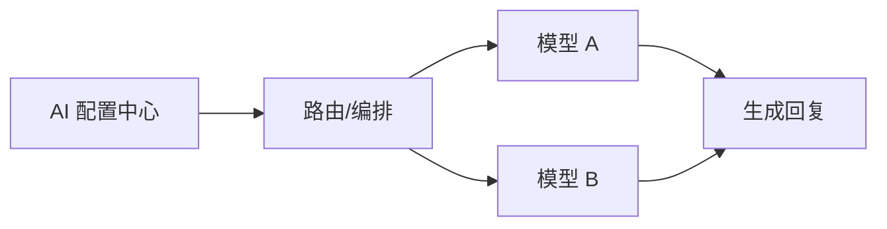

# AI 配置中心 (AGNT AI Configuration)

Version: 1.0  
Last Updated: 2026-01-07

## 1. 功能用途
统一管理 AI 服务商与模型配置，包括 Base URL、模型名称、温度参数与 A/B 测试策略，为各平台回复提供稳定的生成能力。

## 2. 操作步骤

### 2.1 进入配置中心
- 左侧平台选择：🧠 AGNT AI配置中心

### 2.2 基本配置
- Base URL：填写兼容 OpenAI 格式的 API 根地址（无需附加 `/chat/completions`）  
- 模型名称：选择或输入模型 ID（如 `gpt-4o-mini`）  
- 温度参数：设置创作性（建议 0.3～0.8）

### 2.3 自动修复
- 系统会自动修正 Base URL 常见错误（补 https://、替换 55.ai 为 api.55.ai、追加 /v1）

### 2.4 A/B 测试（可选）
- 可按路由或租户维度配置不同模型与温度，用于对比效果

## 3. 参数配置说明

- AI_BASE_URL：API 根地址  
- AI_MODEL_NAME：默认模型名称  
- AI_TEMPERATURE：默认温度  
- 平台覆盖：可由编排/路由决定实际调用模型与 Base URL

## 4. 常见问题 (FAQ)

- Q: API Key 如何填写？  
  A: 在 .env 中配置，后台不展示明文，运行时加载。
- Q: Base URL 报错怎么办？  
  A: 检查是否以 https 开头、域名正确且以 /v1 结尾。
- Q: 模型不支持 JSON 输出？  
  A: 将响应格式设置为 text 或升级兼容模型。

## 5. 示意图

