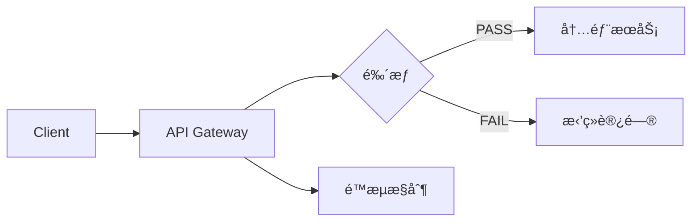

# API ç½‘å…³ç®¡ç† (API Gateway)

Version: 1.0  
Last Updated: 2026-01-07

## 1. 功能用途
统一管ç†å¯¹å¤– API 路由ä¸æƒé™ç­–ç•¥ï¼Œæ”¯æŒ Path/Method/Auth/Rate Limit é…置，便äºé›†æˆç¬¬ä¸‰æ–¹ç³»ç»Ÿå¹¶ç¡®ä¿å®‰å…¨ã€‚

## 2. æ“作步骤

### 2.1 进入 API 网关
- 左侧平å°é€‰æ‹©ï¼šğŸ›£ï¸ APIæ¥å£ç®¡ç†ä¸­å¿ƒ

### 2.2 路由管ç†
- 添加路由：填写路径（Path）ä¸æ–¹æ³•ï¼ˆGET/POST 等）  
- 鉴æƒç­–略：选择是å¦å¯ç”¨ Token 或签å校验  
- é™æµç­–略：é…ç½®å•ä½æ—¶é—´æœ€å¤§è¯·æ±‚æ•°

### 2.3 列表ä¸ç¼–辑
- 在列表中查看所有路由  
- 支æŒç¼–辑更新或删除

## 3. å‚æ•°é…置说æ˜

- path：æ¥å£è·¯å¾„  
- method：HTTP 方法  
- auth：鉴æƒç­–略（none/token/signature）  
- rate_limit：é™æµæ•°å€¼

## 4. 常è§é—®é¢˜ (FAQ)

- Q: 修改路由需è¦é‡å¯å—？  
  A: 当å‰ç‰ˆæœ¬å³æ—¶ç”Ÿæ•ˆï¼Œå续将支æŒç°åº¦å‘布。
- Q: 如何查看访问统计？  
  A: 在商业化è¿è¥çš„æ•°æ®çœ‹æ¿ä¸­æŸ¥çœ‹æŒ‰æ¥å£ç»´åº¦çš„统计。
- Q: 鉴æƒå¤±è´¥å¦‚何定ä½ï¼Ÿ  
  A: 检查签åä¸ Token 生æˆé€»è¾‘，并查看系统日志。

## 5. 示æ„图

```mermaid
flowchart LR
    Client --> Gateway[API Gateway]
    Gateway --> Auth{鉴æƒ}
    Auth -->|PASS| Service[内部æœåŠ¡]
    Auth -->|FAIL| Deny[æ‹’ç»è®¿é—®]
    Gateway --> Rate[é™æµæ§åˆ¶]
```
