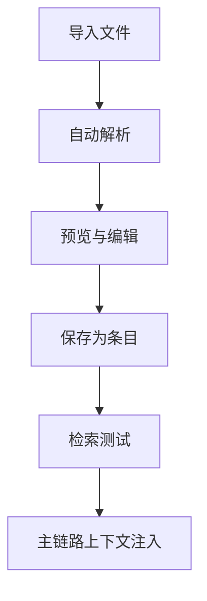

# 知识库配置与检索 (Knowledge Base)

Version: 1.0  
Last Updated: 2026-01-07

## 1. 功能用途
集中管理业务知识条目，支持文本导入、标签与分类维护、检索测试与依赖检查，并在主链路中为 AI 注入参考上下文。

## 2. 操作步骤

### 2.1 管理
- 查看现有条目列表，支持编辑与删除  
- 新建文本条目：填写标题/分类/标签与正文，保存入库

### 2.2 导入
- 上传 txt/md/pdf/docx/xlsx 文件，自动解析并预览  
- 可在保存前编辑解析文本

### 2.3 检索测试
- 输入关键词或问题，选择返回 Top-N  
- 查看命中条目与摘要，校验标签与内容质量

### 2.4 设置
- 依赖检查：PyPDF2、python-docx、openpyxl  
- 缺失依赖时按提示安装

## 3. 参数配置说明

- title：标题  
- category：分类  
- tags：标签（列表或逗号分隔）  
- content：正文文本  
- source_file：来源文件路径（可选）

## 4. 常见问题 (FAQ)

- Q: 大文件会如何处理？  
  A: 上下文注入时会自动截断到安全长度。
- Q: 标签应如何设置？  
  A: 按业务阶段或主题设置，便于检索与路由（如 S1/S2）。
- Q: 文本解析失败怎么办？  
  A: 安装对应依赖或采用手动复制粘贴。

## 5. 示意图

