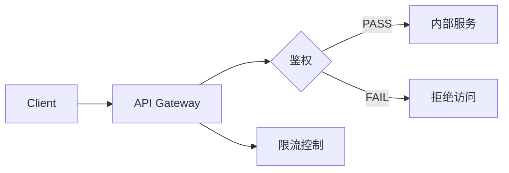

# API 网关管理 (API Gateway)

Version: 1.0  
Last Updated: 2026-01-07

## 1. 功能用途
统一管理对外 API 路由与权限策略，支持 Path/Method/Auth/Rate Limit 配置，便于集成第三方系统并确保安全。

## 2. 操作步骤

### 2.1 进入 API 网关
- 左侧平台选择：🛣️ API接口管理中心

### 2.2 路由管理
- 添加路由：填写路径（Path）与方法（GET/POST 等）  
- 鉴权策略：选择是否启用 Token 或签名校验  
- 限流策略：配置单位时间最大请求数

### 2.3 列表与编辑
- 在列表中查看所有路由  
- 支持编辑更新或删除

## 3. 参数配置说明

- path：接口路径  
- method：HTTP 方法  
- auth：鉴权策略（none/token/signature）  
- rate_limit：限流数值

## 4. 常见问题 (FAQ)

- Q: 修改路由需要重启吗？  
  A: 当前版本即时生效，后续将支持灰度发布。
- Q: 如何查看访问统计？  
  A: 在商业化运营的数据看板中查看按接口维度的统计。
- Q: 鉴权失败如何定位？  
  A: 检查签名与 Token 生成逻辑，并查看系统日志。

## 5. 示意图

