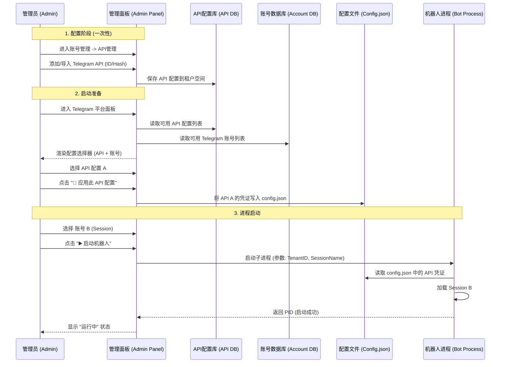
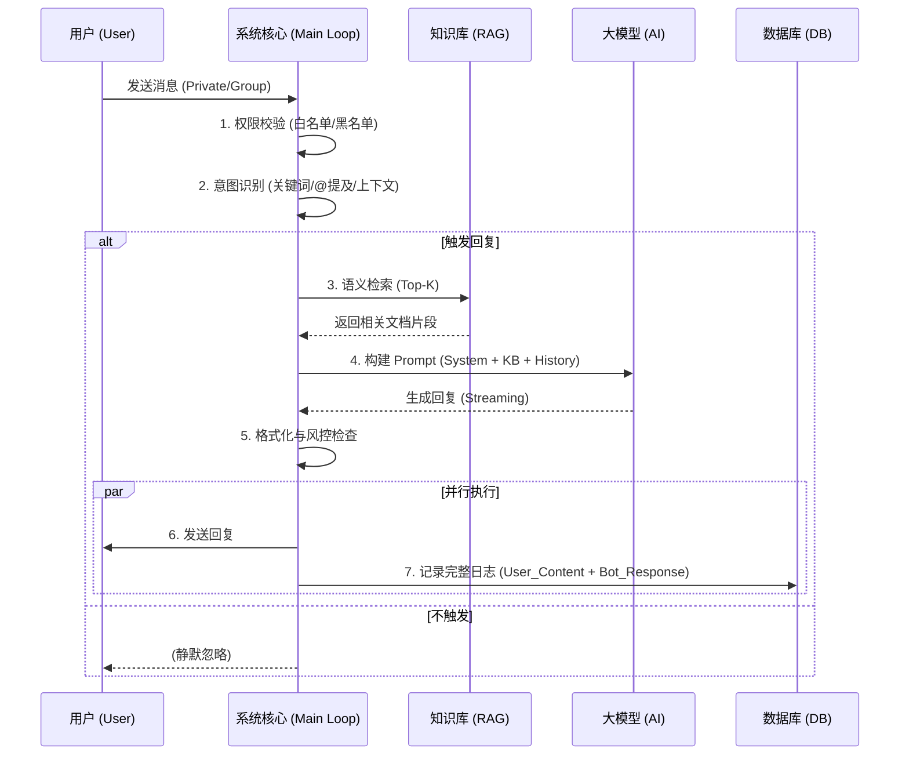

# Telegram AI Bot 智能客服系统 - 技术白皮书 (Technical Whitepaper)

## 1. 产品概述 (Product Overview)

本系统是一套企业级、高并发、支持多模态交互的智能客服解决方案。基于 Telegram 平台，融合了**大语言模型 (LLM)**、**检索增强生成 (RAG)**、**多智能体编排 (Multi-Agent Orchestration)** 以及 **实时风控审计** 技术，旨在为企业提供 7x24 小时的自动化客户服务与营销支持。

核心设计理念：**“让 AI 像资深员工一样思考与工作”**。

---

## 2. 系统核心架构 (Core Architecture)

系统采用微服务分层架构，确保高可用性与可扩展性。

### 2.1 架构分层图

```mermaid
graph TD
    User((用户/User)) --> |Telegram API| Gateway[消息网关 / Event Loop]
    
    subgraph "核心处理层 (Core Processing)"
        Gateway --> |分发| PreProcessor[预处理与过滤器]
        PreProcessor --> |通过| Router{智能路由 / Router}
        
        Router --> |模式 A| SimpleRAG[快速问答 (KB-Only)]
        Router --> |模式 B| Orchestrator[多智能体编排 (SOP)]
        
        Orchestrator --> Supervisor[Supervisor Agent\n(状态机管理)]
        Supervisor --> Worker1[销售 Agent]
        Supervisor --> Worker2[客服 Agent]
        Supervisor --> Worker3[技术 Agent]
    end
    
    subgraph "知识与记忆层 (Knowledge & Memory)"
        SimpleRAG <--> VectorDB[(向量数据库 / Knowledge Base)]
        Orchestrator <--> ContextDB[(会话上下文 / Redis+SQLite)]
        PDF_Engine[PDF/Doc 解析引擎] --> |ETL| VectorDB
    end
    
    subgraph "风控与自学习层 (Security & Learning)"
        Router -.-> |异步| Auditor[双重审计系统 / Dual Audit]
        Auditor --> |拦截| Block[阻断回复]
        Auditor --> |放行| ReplySender
        
        ReplySender --> |记录| DataLake[(数据湖 / Message Events)]
        DataLake --> |训练| SelfLearning[AI 自学习模块]
    end
    
    ReplySender --> |API| User
```

### 2.2 系统功能全景图


---

## 3. 关键逻辑流程 (Key Logic Flows)

### 3.1 机器人启动与配置流程 (Startup & Configuration Flow)
*v2.5.0 新增*：为了支持多租户与多 API 环境，系统的启动流程引入了动态配置加载机制。



### 3.2 消息处理全链路 (Message Pipeline)

系统对每一条消息进行毫秒级的多维度处理，确保响应的准确性与安全性。



### 3.2 智能路由与判断逻辑 (Decision Logic)

系统不仅仅是简单的问答，而是具备“判断力”的智能体。

*   **场景感知**：自动区分私聊（一对一服务）与群聊（公共空间）。
*   **上下文记忆**：通过 `ConversationStateManager` 维护多轮对话状态。
*   **模式切换**：
    *   **快速响应模式 (KB-Only)**：针对常见 FAQ，直接调用知识库，响应速度快，成本低。
    *   **编排模式 (Orchestration)**：针对复杂业务（如注册引导、充值流程），激活 SOP 状态机，一步步引导用户。

### 3.3 AI 自学习闭环 (Self-Learning Loop)

**这是本系统的核心进化能力。**

1.  **数据捕获 (Data Capture)**:
    *   系统实时记录每一条 `User Input` 和 `AI Response` 到 `message_events` 表。
    *   记录元数据：Token 消耗、响应时长、所属阶段 (Stage)。

2.  **自动优化 (Auto-Optimization)** (规划中):
    *   **Bad Case 分析**: 识别用户追问、负面反馈的对话。
    *   **知识库补全**: 将未命中的高频问题自动提取，提示管理员补充。
    *   **模型微调 (Fine-tuning)**: 利用高质量历史对话数据，微调私有模型，使其更懂业务“黑话”。

---

## 4. 核心功能说明 (Feature Descriptions)

### 4.1 强大的知识库引擎 (Knowledge Engine)
*   **多格式支持**: 支持 **PDF**, **Word**, **Excel**, **TXT** 等多种格式直接导入。
*   **智能解析**: 内置 `PyPDF2` 和 `python-docx` 引擎，自动提取文本、表格内容。
*   **混合检索**: 结合关键词匹配 (BM25) 与 语义检索 (Embedding)，确保“搜得准”。

### 4.2 双重审计系统 (Dual Audit System)
*   **内容风控**: 防止 AI 输出涉黄、涉政或竞品敏感信息。
*   **策略**:
    *   **本地审计 (Local Rule)**: 基于正则表达式和关键词库，毫秒级拦截。
    *   **AI 审计 (LLM Audit)**: 使用独立的 Auditor Agent 对回复进行语义审查。

### 4.3 多平台管理后台 (Multi-Platform Admin Panel)
*   **可视化配置**: 无需修改代码，通过 Web 界面即可调整 AI 人设、温度、回复策略。
*   **热更新 (Hot-Reload)**: 修改配置或更新知识库后，**无需重启服务**，即刻生效。
*   **数据看板**: 实时监控 Token 使用量、活跃用户数、系统健康状态。

---

## 5. 使用与部署说明 (Usage & Deployment)

### 5.1 环境要求
*   **OS**: Windows Server / Linux
*   **Runtime**: Python 3.8+ (推荐使用内置虚拟环境)
*   **Database**: SQLite (内置) / PostgreSQL (可选)

### 5.2 快速启动
1.  **一键安装**: 运行 `install.bat` 自动初始化环境。
2.  **启动后台**: 运行 `start_multi_admin.bat` 进入管理面板。
3.  **启动机器人**: 运行 `run.bat` 开启服务。
    *   *系统具备自愈能力，启动时会自动检测并修复缺失依赖。*

### 5.3 故障排查
*   **日志系统**: 详尽的 `trace.jsonl` 记录了每一次 AI 决策的思维链 (Chain of Thought)。
*   **健康检查**: 后台面板提供系统状态“红绿灯”指示。

---

> **总结**: 本系统不仅仅是一个聊天机器人，而是一个具备 **感知、决策、执行、学习** 能力的数字化劳动力平台。
