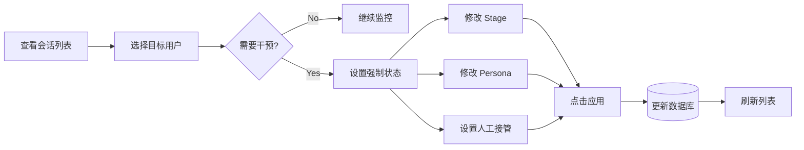

# 监管面板 (Supervisor)

> **Version**: 2.5.0  
> **Last Updated**: 2026-01-12


监管面板提供上帝视角，允许管理员查看实时会话状态，并在必要时强制干预对话流程或回放历史决策。

## 📊 逻辑架构

### 状态干预流程 (BPMN Flowchart)



### 决策回放机制 (Logic Diagram)

```mermaid
graph TD
    History[历史路由记录] -->|Select Index| Snapshot[加载决策快照]
    Snapshot --> ViewContext[查看输入上下文]
    Snapshot --> ViewResult[查看匹配规则]
    
    Snapshot --> ReplayAction[点击 "加载到模拟器"]
    ReplayAction -->|URL Query Params| SimTab[跳转: 编排面板/模拟决策]
    SimTab -->|Auto Fill| SimInput[自动填充参数]
    SimInput --> Rerun[管理员手动点击模拟]
    Rerun --> Compare[对比新旧结果]
```

## 🕹️ 功能操作指南

### 1. 会话管理 (Session Management)
**面包屑**: `监管面板` > `会话管理` Tab

- **会话列表**: 
  - 默认展示最近活跃用户的 `User ID`, `Platform`, `Current Stage`, `Updated At`。
  - **手动刷新**: 点击 `🔄 刷新会话列表` 按钮可强制从数据库重新加载最新数据（支持加载状态显示与错误提示）。
- **干预控制区**:
  - `Select User`: 下拉选择要干预的用户。
  - `Force Stage`: 强制跳转到的阶段 (S0-S5)。
  - `Force Persona`: 强制设定的人设 ID。
  - `Handoff Required`: 勾选后标记为需要人工介入。
- **操作按钮**: `应用变更 (Apply Changes)`
  - **点击效果**: 写入数据库，成功后自动刷新页面。
  - **异常处理**: 若数据库连接失败，显示错误详情。

### 2. 决策回放 (Decision Replay)
**面包屑**: `监管面板` > `决策回放` Tab

用于审计 AI 的历史路由选择是否正确。

- **路由记录列表**: 展示时间戳、用户、选用模型及最终得分。
- **详情展开 (Expander)**:
  - 点击记录行，展开显示完整的 JSON Context 和 Matched Rule。
- **操作按钮**: `🔁 加载到模拟器`
  - **点击效果**: 
    1. 跳转至 [编排面板](协调器.md) 的模拟决策页。
    2. URL 参数携带该条记录的 Context。
    3. 页面自动读取参数并填入输入框。
  - **关联功能**: 此功能是连接“事后审计”与“事前验证”的桥梁。

### 3. 异常处理与系统鲁棒性 (Reliability)

Supervisor 内置了多层级的容错与降级机制，确保在 AI 服务波动时系统的可用性。

#### 🛡️ 自动降级 (Fallback Mode)
当 Supervisor Agent 调用 LLM 失败（如超时、API 错误、解析失败）时，系统将触发 **Fallback 流程**：

1. **日志记录**: 错误详情会被记录到 `audit_logs` 数据库中，类型为 `supervisor_error`。
2. **状态保持**: 用户的当前 `Stage` 和 `Persona` 保持不变，防止状态错乱。
3. **兜底回复**: 
   - 系统会自动接管，向用户发送预设的友好提示（如 *"System is currently experiencing high load..."*）。
   - 该回复不消耗 Token，且不会中断会话状态。

#### 🔍 故障排查
- 若发现大量 Fallback 记录，请检查：
  - OpenAI API Key 余额及连通性。
  - `business_core.py` 中的模型配置是否正确。
  - Admin 面板的 "Business Metrics" 是否有异常成本激增。
