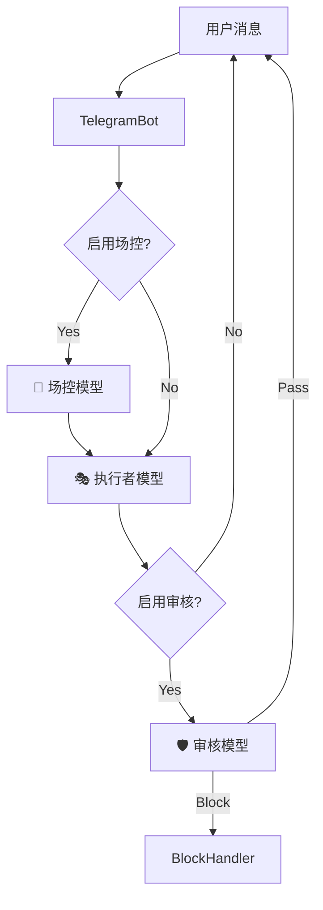

# AI 配置中心 (AGNT AI Configuration)

Version: 2.5.0
Last Updated: 2026-01-09

## 1. 功能概述
AGNT AI 配置中心是系统的智能核心，采用 **模型注册表 (Model Registry)** 与 **会话链路 (Session Pipeline)** 双层架构。
支持租户隔离，允许每个租户独立注册多个 AI 模型，并灵活定义会话过程中各环节（场控、执行、审计）所使用的具体模型。

## 2. 功能模块

### 2.1 🤖 模型注册表 (Model Registry)
在此处录入和管理可用的 AI 模型资源。

**操作步骤**：
1. **添加模型**：
    - **提供商 (Provider)**: 选择 OpenAI, DeepSeek, Anthropic, LocalAI 等。
    - **Base URL**: API 接口地址 (如 `https://api.openai.com/v1`)。
    - **模型名称**: 具体模型 ID (如 `gpt-4o`, `deepseek-chat`)。
    - **API Key**: 输入 API 密钥 (保存后自动加密/脱敏显示 `******`)。
    - **权重/超时**: 设置负载均衡权重与请求超时时间。
    - **备注**: 方便识别的用途说明 (如 "逻辑分析专用")。
2. **保存**: 点击保存后，模型将加入当前租户的可用资源池。

> **数据安全**: API Key 仅保存在服务器端 `ai_providers.json` 中，前端列表仅显示掩码，确保凭证安全。

### 2.2 ⛓️ 会话智能体配置 (Session Agent Pipeline)
在此处定义 AI 会话的执行流程，将注册好的模型分配给不同的智能体角色。

**核心角色**：
1. **🧠 场控 (Supervisor)**:
    - **职责**: 负责意图识别、流程编排、工具调用决策。
    - **推荐模型**: 逻辑能力强的高智商模型 (如 GPT-4, Claude 3.5 Sonnet)。
    - **开关**: 可通过 "启用场控" 开关控制是否介入。

2. **🎭 执行者 (Worker / Stage Agent)**:
    - **职责**: 负责具体的回复生成、角色扮演、内容创作。
    - **推荐模型**: 响应速度快、拟人化程度高的模型 (如 GPT-4o-mini, DeepSeek-V3)。

3. **🛡️ 初审 (Audit Primary)**:
    - **职责**: 对执行者生成的内容进行第一轮合规性审核。
    - **开关**: "启用初审"。

4. **⚖️ 复审 (Audit Secondary)**:
    - **职责**: (可选) 第二轮双重审计，用于高安全需求场景。

**生效机制**:
- 点击 **"💾 保存链路配置"** 后，系统会将绑定关系写入 `config.txt`。
- 此处的开关状态（如"启用场控"）与 **Telegram 面板 > 配置** 中的开关是实时同步的。
- 机器人（Telegram/WhatsApp）在处理消息时，会实时读取此配置，动态调用指定的模型。

## 3. 常见问题 (FAQ)

*   **Q: 为什么我在 "账号管理" 里配置了 API，机器人还是不回复？**
    *   A: "账号管理" 仅配置连接平台的凭证。请确保您在 "AI 配置中心" 的 "会话智能体配置" 中已绑定了有效的 **执行者 (Worker)** 模型。

*   **Q: 系统默认 (System Default) 是什么？**
    *   A: 仅 `default` 租户可见。新租户需要手动注册并配置自己的 AI 模型。

*   **Q: 修改配置后需要重启机器人吗？**
    *   A: **不需要**。AI 配置支持热更新，保存后即刻在下一次对话中生效。

## 4. 架构示意

## 修订记录

| 版本号 | 更新日期 | 修改人 | 修改摘要 |
| :--- | :--- | :--- | :--- |
| v2.5.0 | 2026-01-09 | System Admin | 重构文档，匹配 Model Registry + Pipeline 双层架构，更新架构图 |
| v1.0.6 | 2026-01-09 | Tech Writer | 补充租户隔离保存路径与学习/技能绑定说明 |
