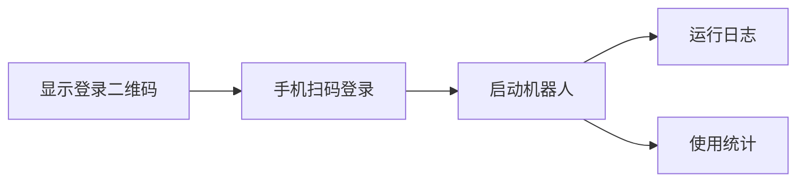

# WhatsApp 平台管理 (WhatsApp Platform)

Version: 2.5.1  
Last Updated: 2026-01-12

## 1. 功能用途
提供 WhatsApp 机器人登录、启停、日志与统计查看能力，支持二维码登录与群发基础功能。

## 2. 操作步骤

### 2.1 登录与启停
- 打开“WhatsApp 自动回复机器人”面板  
- 登录二维码：点击刷新查看当前二维码并使用手机扫码  
- 启动/停止/重启：按按钮控制机器人运行状态

### 2.2 日志与统计
- 日志：查看最近运行日志，支持刷新与清空  
- 统计：查看消息数量、成功率与活跃度

### 2.3 群发（如启用）
- 选择群组与间隔，输入消息内容后执行群发  
- 查看群发记录列表，支持清空

## 3. 参数配置说明

- 平台账号状态：是否已登录  
- 群发间隔：发送消息间隔秒数  
- 日志文件：平台专属日志路径

## 4. 常见问题 (FAQ)

- Q: 二维码过期怎么办？  
  A: 点击刷新或重启机器人生成新的二维码。
- Q: 被限流如何处理？  
  A: 增加发送间隔、降低并发或联系平台支持。
- Q: 日志文件为空？  
  A: 确认机器人已启动并产生事件。

## 5. 示意图

