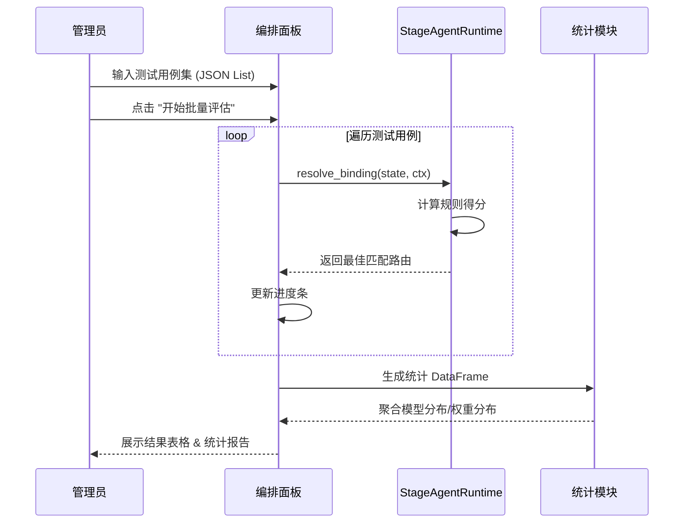

# 编排管理 (Orchestrator)

> **Version**: 2.5.0  
> **Last Updated**: 2026-01-12


编排面板是系统的核心配置中心，负责定义 AI 如何根据用户状态（Stage）和人设（Persona）进行路由决策。

## 📊 逻辑架构

### 核心路由逻辑 (Logic Diagram)

```mermaid
graph TD
    Start[用户消息输入] --> Normalize[标准化处理]
    Normalize --> Context[提取上下文 (Intent/Risk/KB)]
    Context --> MatchRules{匹配绑定规则}
    
    MatchRules -->|精确匹配| Score1[计算得分: Base + Bonus]
    MatchRules -->|模糊匹配| Score2[计算得分: Base + Bonus]
    
    Score1 --> Sort[按得分排序]
    Score2 --> Sort
    
    Sort --> Top1{最高分规则}
    Top1 -->|存在| Apply[应用模型配置]
    Top1 -->|不存在| Fallback[应用默认配置]
    
    Apply --> Output[生成路由决策]
    Fallback --> Output
```

### 批量评估时序 (Sequence Diagram)



## 🕹️ 功能操作指南

### 1. 模拟决策 (Simulation)
**面包屑**: `编排面板` > `模拟决策` Tab

用于单次测试路由逻辑是否符合预期。

- **输入区域**:
  - `Current Stage`: 模拟当前用户所处阶段
  - `Persona ID`: 模拟当前人设
  - `User Message`: 模拟用户发送的消息
- **操作按钮**: `执行模拟`
  - **点击效果**: 右侧显示路由决策结果 JSON，包含匹配的模型、温度及最终得分。
  - **异常处理**: 若输入格式非法，顶部弹出 Error Toast。

### 2. 批量评估 (Batch Evaluation)
**面包屑**: `编排面板` > `批量评估` Tab

用于大规模验证路由策略的稳定性。

- **输入区域**: `测试用例集 (JSON List)`
  - **格式要求**: JSON 数组，每个对象包含 `stage`, `persona`, `msg`, `intent` 等字段。
- **操作按钮**: `开始批量评估`
  - **点击效果**: 
    1. 进度条从 0% 走到 100%。
    2. 展示详细结果表格。
    3. 底部展示“模型分布”和“权重分布”统计数据。
  - **关联功能**: 发现异常 Case 后，可复制参数到 [模拟决策](#1-模拟决策-simulation) 进行详细调试。

### 3. 风格守卫 (Style Guard)
**面包屑**: `编排面板` > `Style Guard 配置` Tab

配置 AI 回复的后处理规则。

- **配置项**:
  - `identity_patterns`: 正则列表，用于拦截 AI 自称（如 "我是AI"）。
  - `max_questions`: 限制单次回复中的最大问句数量。
- **操作按钮**: `保存 Style Guard 配置`
  - **点击效果**: 立即更新数据库中的配置，无需重启服务。
  - **异常处理**: 若 JSON 语法错误，提示解析失败。

### 4. 健康检查 (Health Check)
**面包屑**: `编排面板` > `健康检查` Tab

自动化检测系统关键配置的完整性。

- **检查项**:
  - API Key 配置
  - 编排模式开关 (CONV_ORCHESTRATION)
  - Stage/Persona 基础数据
  - 路由绑定策略
- **操作按钮**: `开始检查`
  - **点击效果**: 逐项扫描配置，输出 ✅ 通过或 ❌ 失败/⚠️ 警告列表。
