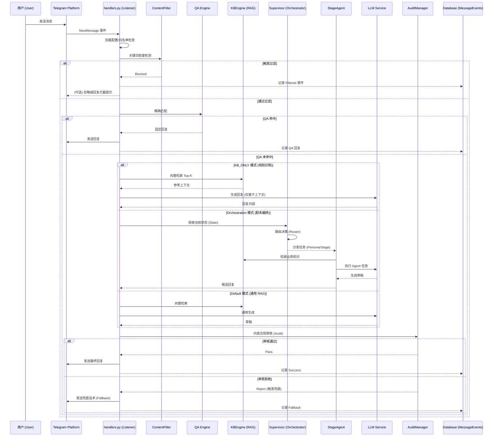
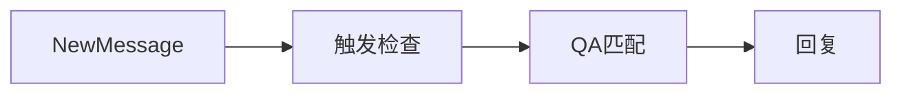
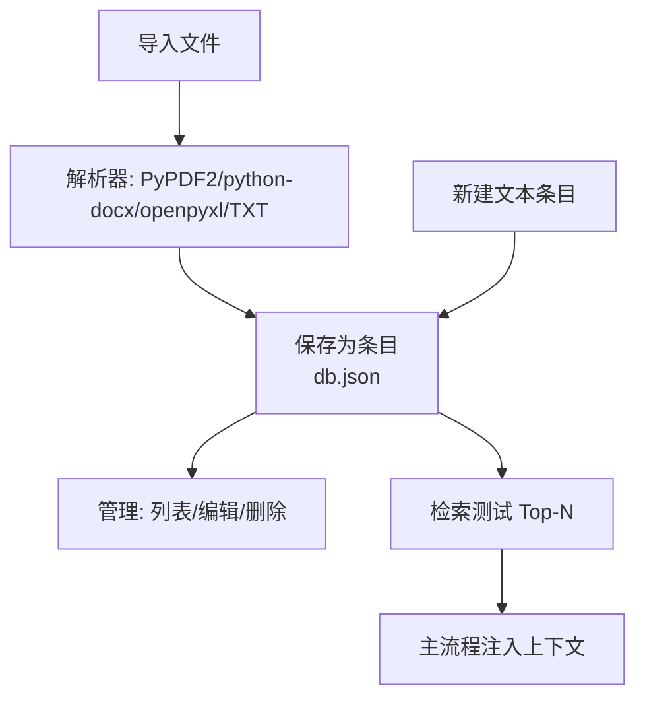
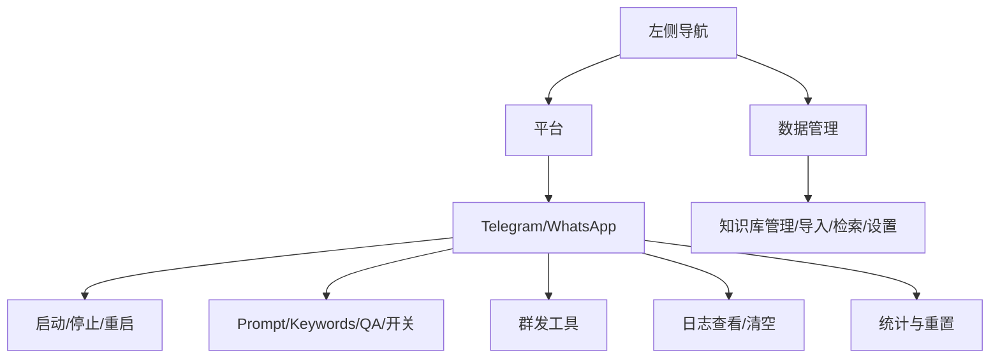
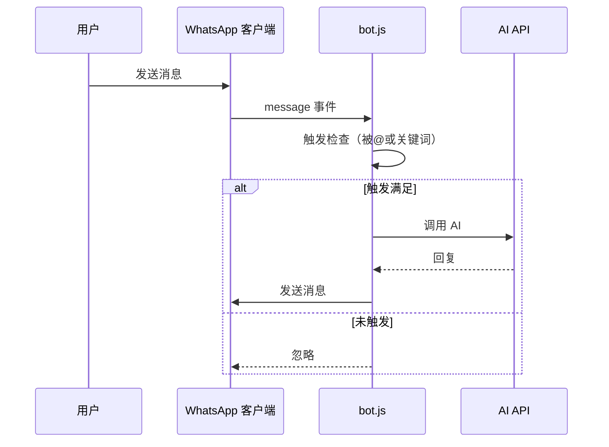
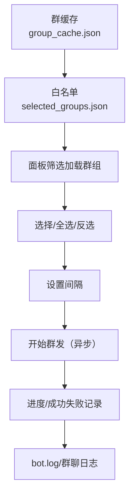
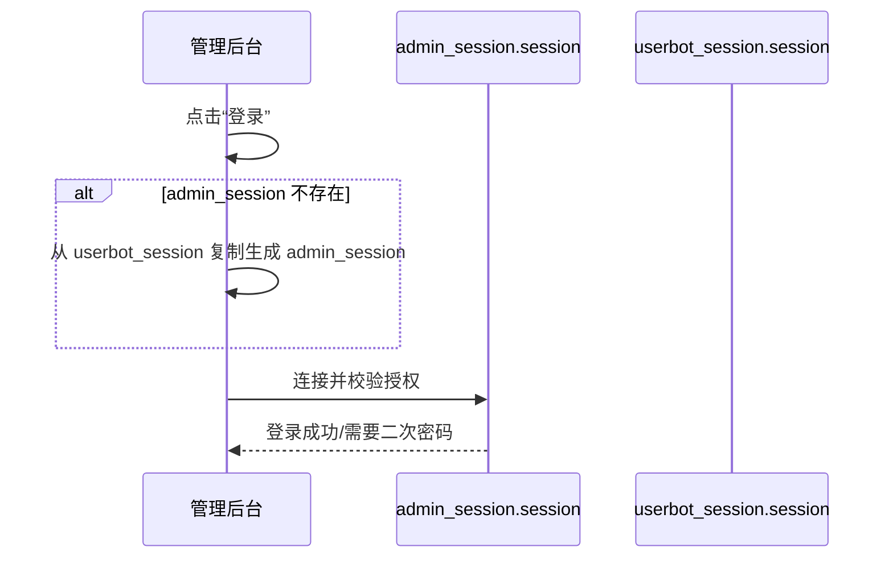
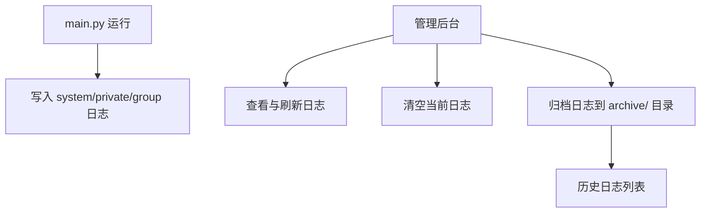

# 系统业务流程与架构图

## 总览架构

```mermaid
graph TD
    Admin[管理后台 Streamlit<br/>admin_multi.py/admin.py] -->|配置/操作| TG[Telegram Bot<br/>main.py/Telethon]
    Admin -->|配置/操作| WA[WhatsApp Bot<br/>platforms/whatsapp/bot.js]
    TG -->|读取/写入| CFG[(配置与话术<br/>data/tenants/{tenant}/platforms/telegram/*)]
    TG --> LOGS[(日志<br/>data/tenants/{tenant}/platforms/telegram/logs/*)]
    TG --> STATS[(统计<br/>data/tenants/{tenant}/platforms/telegram/stats.json)]
    TG --> KB[(知识库<br/>data/knowledge_base/db.json + files/)]
    TG -->|AI请求| API[(OpenAI兼容 API)]
    WA -->|AI请求| API
    Admin --> KB
    Admin --> LOGS
    Admin --> STATS
```

## Telegram 消息处理流程（时序）



## Telegram 触发与回复（流程图）



## 知识库生命周期（导入/管理/检索）



## 管理后台（多平台面板）



## WhatsApp 消息处理（时序）



## 关键代码参考
- 事件处理与触发逻辑：[main.py:386-457](file:///d:/AI%20Talk/main.py#L386-L457)
- QA 解析与匹配：[main.py:158-241](file:///d:/AI%20Talk/main.py#L158-L241)
- 知识库读取与检索注入：[main.py:241-305](file:///d:/AI%20Talk/main.py#L241-L305)、[main.py:466-481](file:///d:/AI%20Talk/main.py#L466-L481)
- 管理后台平台与面板：[admin_multi.py:409-545](file:///d:/AI%20Talk/admin_multi.py#L409-L545)
- 知识库管理/导入/检索/设置：[admin_multi.py:446-750](file:///d:/AI%20Talk/admin_multi.py#L446-L750)
- WhatsApp 机器人主逻辑：[platforms/whatsapp/bot.js](file:///d:/AI%20Talk/platforms/whatsapp/bot.js)

---

## 群白名单与群发流程



## 后台登录与会话复用



## 错误处理与日志归档


