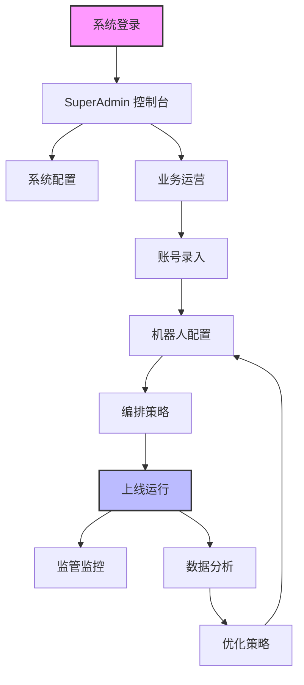

# 帮助中心 v2.5.1

欢迎使用 AI 剧本配置系统帮助中心。本文档体系旨在帮助您快速掌握系统的核心功能与操作流程。

## 🗺️ 用户操作流程图

## 📚 文档目录

### 1. 基础入门
- **[🚀 快速入门](快速开始.md)**: 系统登录、界面概览、身份切换。
- **[📱 账号管理](账号管理.md)**: 社交媒体账号录入、更新与标签管理。

### 2. 核心配置
- **[🤖 机器人配置](机器人配置.md)**: AI 模型接入、平台机器人创建与知识库挂载。
- **[🎭 编排管理](协调器.md)**: 核心路由逻辑、人设绑定与策略配置。
- **[🧠 AI 配置中心](AI配置.md)**: Base URL/模型/温度与自动修复、A/B 测试。
- **[🧪 AI 学习中心](AI学习.md)**: 对话采集数据清洗、标记可学习、绑定 AI 与导出学习集。
- **[🧩 Skills 技能中心](技能中心.md)**: 技能配置、启停、版本管理与绑定 AI 业务线。
- **[🛣️ API 网关管理](API网关.md)**: 路由/鉴权/限流配置。
- **[🛡️ 审核配置中心](审核配置.md)**: 关键词/审核模式/兜底与日志。
- **[📚 知识库](知识库.md)**: 条目管理、导入解析与检索测试。

### 3. 运营与监控
- **[🛰️ 监管面板](监控器.md)**: 实时会话监控、人工干预与历史回放。
- **[📊 数据统计与分析](数据分析.md)**: 业务数据看板、核心指标解读与报表导出。

### 4. 系统管理
- **[⚙️ 系统设置](系统设置.md)**: 全局参数配置、API 网关与权限管理。
- **[📝 版本更新记录](版本历史.md)**: 查看文档与系统的更新日志。

### 5. 平台专属指南
- **[📱 Telegram 机器人](Telegram平台.md)**: Telegram 专有的消息流程、群发与白名单配置。
- **[💬 WhatsApp 机器人](WhatsApp平台.md)**: 二维码登录、启停、日志与统计。

### 6. 系统状态与维护
- **[🚥 系统运作状态面板](系统状态.md)**: 总览灯与节点矩阵、失败定位。
- **[📒 文档维护与检查机制](文档维护.md)**: 周期检查、变更流程与模板规范。

## 🛠️ 常见问题
如果在文档中未找到所需信息，请联系系统管理员或查看各章节末尾的 FAQ 部分。
