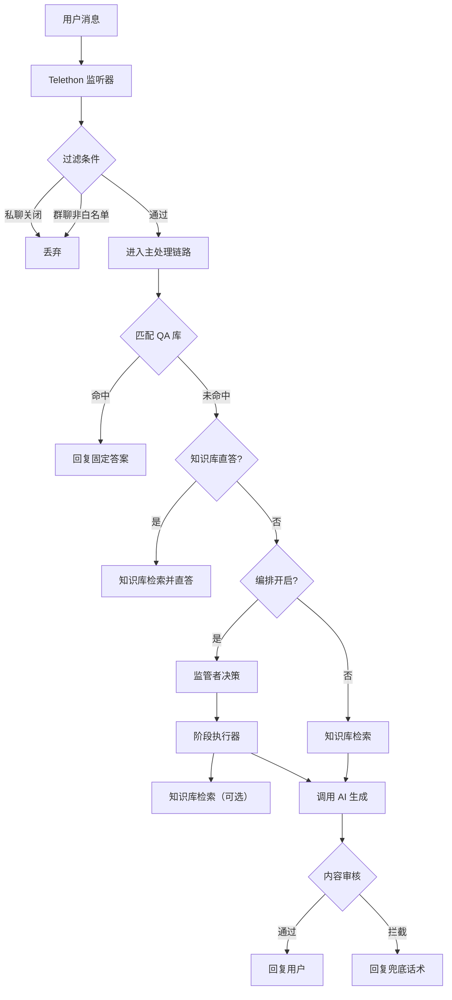

# Telegram 平台管理 (Telegram Platform)

Version: 2.5.1
Last Updated: 2026-01-09

Telegram 平台管理面板提供配置、日志查看、群发消息及统计功能。

## 📊 逻辑架构

### 消息处理流程 (Message Flow)

## 🕹️ 功能操作指南

### 0. 🎯 运行配置选择 (Run Configuration)
**位置**: 面板顶部区域

在启动机器人之前，您需要选择使用哪套 API 配置以及哪个 Telegram 账号。

- **🤖 Bot API 配置**:
    - 下拉选择已在【账号管理】中添加的 API 配置。
    - **应用按钮**: 如果选中的配置与当前底层生效的不一致，会出现 **"🚀 应用此 API 配置"** 按钮。点击后，系统会更新底层的 `config.json`，确保机器人使用正确的 API ID/Hash 启动。
- **👤 Telegram 账号**:
    - 选择要登录的账号 Session 文件。
    - 如果是首次登录，点击 "去登录" 按照提示输入手机号和验证码。

### 1. 统计管理 (Statistics)
**面包屑**: `Telegram` > `统计` Tab

查看机器人的运行数据。

- **操作按钮**: `刷新统计`
  - **点击效果**: 重新加载并显示最新的消息计数、成功率等数据。
- **操作按钮**: `🗑️ 重置统计`
  - **点击效果**: 将所有统计计数清零，并重置开始时间。
  - **异常处理**: 需要确认操作，不可恢复。

### 2. 配置管理 (Configuration)
**面包屑**: `Telegram` > `配置` Tab

管理功能开关、人设 Prompt、关键词及 QA 库。

> **注意**: AI 模型的选择与绑定（如 GPT-4o, DeepSeek）请前往 **"🧠 AI 配置中心"** 进行设置。此处仅控制功能开关（如是否启用 AI 场控）。

- **操作按钮**: `💾 保存配置`
  - **点击效果**: 将当前开关状态写入 `config.txt`，立即生效。
- **操作按钮**: `💾 保存人设`
  - **点击效果**: 更新 `prompt.txt`。

### 3. 日志查看 (Logs)
**面包屑**: `Telegram` > `日志` Tab

查看系统运行日志。

- **操作按钮**: `加载日志`
  - **点击效果**: 读取最新的日志文件内容。
- **操作按钮**: `清空日志`
  - **点击效果**: 删除当前日志文件内容。
