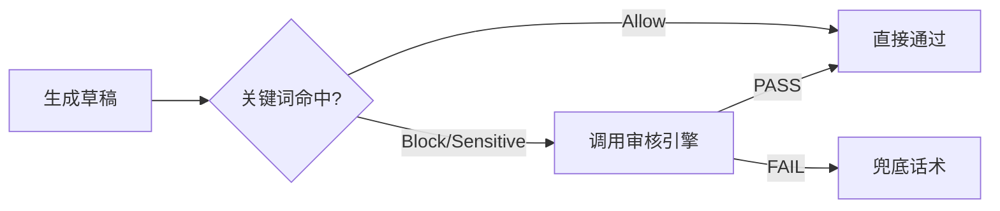

# 审核配置中心 (Audit Center)

Version: 2.5.1  
Last Updated: 2026-01-12

## 1. 功能用途
审核配置用于在对话生成链路中进行风险拦截与风格一致性约束，支持违禁词/敏感词/允许词管理、审核模式与远程审核服务配置、兜底话术库维护及审核日志查看。

## 2. 操作步骤

### 2.1 进入审核配置
- 左侧平台选择：🛡️ 审核配置  
- 侧边栏身份切换为 Auditor（审核员），具备编辑权限

### 2.2 关键词管理
- 违禁词（Block）：命中即拦截并触发兜底  
- 敏感词（Sensitive）：记录并可配置为拦截或警告  
- 允许词（Allow）：白名单优先通过
- 操作：添加、删除、重命名，变更后即时生效

### 2.3 审核模式与重试
- 审核模式（本地/远程/双机）：决定调用本地审核或远程审核 API  
- 最大重试次数：审核失败时的重试上限  
- 审核温度：审核模型的采样温度（建议 0.0～0.3）

### 2.4 兜底话术库
- 进入“审核员兜底话术库”编辑框，维护拦截时的统一回复文案  
- 保存后立即生效

### 2.5 审核日志查看
- 切换至“审核日志”页签，查看最近拦截记录与分类统计  
- 支持刷新与清空

## 3. 参数配置说明

- AUDIT_ENABLED：是否启用审核（on/off）
- AUDIT_MODE：审核模式（local/remote/dual）
- AUDIT_MAX_RETRIES：审核重试上限（整数）
- AUDIT_TEMPERATURE：审核模型温度（0.0～0.5）
- AUDIT_SERVERS：远程审核服务器地址列表（逗号分隔）
- 关键词分组：block/sensitive/allow 三类

## 4. 常见问题 (FAQ)

- Q: 变更关键词后需要重启吗？  
  A: 不需要，保存即生效。
- Q: 审核误拦如何处理？  
  A: 将相关词加入允许词（Allow），或调整审核模式与温度。
- Q: 远程审核不可达怎么办？  
  A: 切换至本地审核模式或检查网络与服务可用性。

## 5. 示意图

